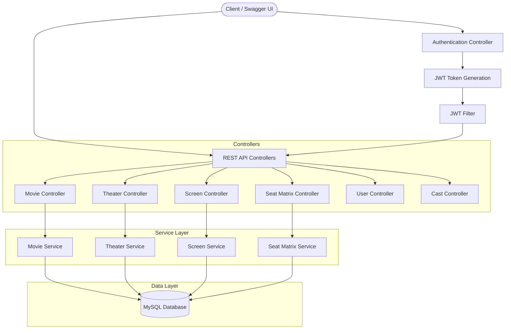

# BookMyShow System Design 🎬


A **movie ticket booking system** inspired by BookMyShow, built as a system design exercise demonstrating real-world backend patterns: JWT authentication, relational entity modeling, seat availability management, and RESTful API design.

## Architecture



## Domain Model

The system models the following core entities:

| Entity | Description |
|--------|-------------|
| **Movie** | Film details (name, genre, release date) |
| **Theater** | Cinema hall (name, location, city) |
| **Screen** | Individual screen within a theater |
| **Show** | A screening — links a Movie to a Screen at a specific time |
| **SeatMatrix** | Seat availability per show (seat number, type, price, status) |
| **Booking** | User booking with payment reference |
| **Payment** | Payment transaction details |
| **User** | Registered user with JWT authentication |
| **Cast** | Actors/directors associated with movies |
| **Notification** | User notifications for bookings |
| **Offer** | Promotional offers and discounts |

## API Endpoints

| Method | Endpoint | Description |
|--------|----------|-------------|
| `POST` | `/authenticate` | Login and receive JWT token |
| `GET` | `/movies` | List all movies |
| `POST` | `/movies` | Add a new movie |
| `GET` | `/theaters` | List all theaters |
| `POST` | `/theaters` | Add a new theater |
| `GET` | `/screens` | List all screens |
| `POST` | `/screens` | Add a new screen |
| `GET` | `/seatmatrix` | Get seat availability |
| `POST` | `/seatmatrix` | Create seat matrix for a show |
| `GET` | `/users` | List users |
| `POST` | `/users` | Register a new user |
| `GET` | `/casts` | List cast members |

> All endpoints (except `/authenticate`) require a valid JWT Bearer token.

## Technical Highlights

### Handling Double Bookings (Concurrency)
To prevent the classic double-booking problem (where two users attempt to book the same seat simultaneously), this system implements **Distributed Locking using Redis**. 
When a user selects a seat, a Redis lock is acquired for that specific seat ID. If another user attempts to select the same seat while the lock is held, the system rejects the request until the first transaction completes (either successful booking or timeout). This ensures strong consistency and avoids race conditions during high-traffic movie releases.

## Tech Stack

- **Backend**: Java 8, Spring Boot, Spring MVC
- **Security**: Spring Security with JWT (JSON Web Tokens)
- **Database**: MySQL with Spring Data JPA / Hibernate
- **API Docs**: Swagger UI (auto-generated)
- **Containerization**: Docker
- **Build**: Maven

## Getting Started

### Prerequisites
- Java 8+
- Maven
- MySQL (or Docker)

### Run with Docker

```bash
# Build the application
mvn clean package -DskipTests

# Build and run the Docker image
docker build -t bookmyshow .
docker run -p 8080:8080 bookmyshow
```

### Run Locally

1. Configure your MySQL connection in `src/main/resources/application.properties`
2. Build and run:
   ```bash
   mvn clean install
   mvn spring-boot:run
   ```
3. Access Swagger UI at `http://localhost:8080/swagger-ui.html`

### Authenticate
```bash
curl -X POST http://localhost:8080/authenticate \
  -H "Content-Type: application/json" \
  -d '{"username": "admin", "password": "password"}'
```
Use the returned JWT token in the `Authorization: Bearer <token>` header for subsequent requests.

---

<p align="center">
  Built by <a href="https://profile-64ef8.firebaseapp.com/">Ramveer Singh</a> · 
  <a href="https://www.linkedin.com/in/ramveer7up/">LinkedIn</a> · 
  <a href="https://github.com/ramveer93">GitHub</a>
</p>
